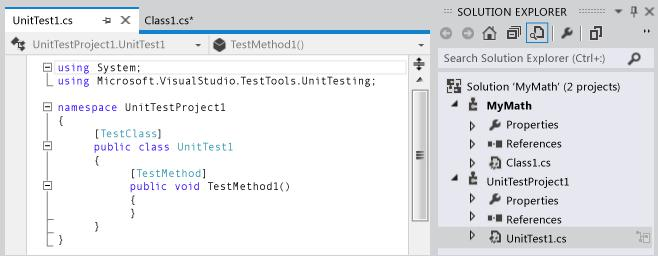
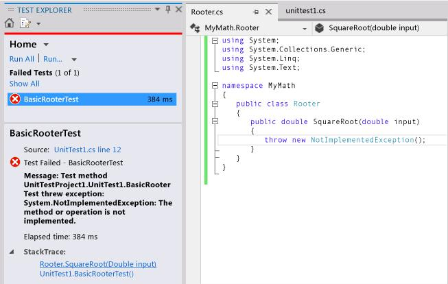
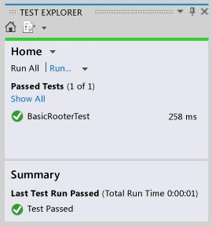

# TDD with Visual Studio

The purpose of this assignment is to experience Test-Driven Development (TDD) using unit testing tools in Visual Studio (VS). You will be guided through using unit tests to develop a method of a class. Additionally, you will review an article critical of TDD, discuss its points in your group, and write conclusions. The focus is on an intelligent discussion of the merits and demerits of TDD from your point of view, rather than finding a right or wrong answer. If your group does not agree with any particular points, you are encouraged to express this.

## Walkthrough: Using Unit Tests to Develop a Method

This walkthrough demonstrates how to develop a tested method in C# using the Microsoft Unit Test framework. You can easily adapt it for other languages and test frameworks such as NUnit. For more information, see [Using Different Test Frameworks](https://msdn.microsoft.com/en-us/library/hh212233(v=vs.110).aspx#frameworks).

### Creating the Test and Method

1. **Create a Visual C# Class Library project**: This project will contain the code to be delivered. In this example, it is named **MyMath**.
2. **Create a Test project**:
    - In the **New Project** dialog, choose **Visual C#**, **Test**, and then select **Unit Test Project**.



3. **Write a basic test method** to verify the result obtained for a specific input:

    ```csharp
    [TestMethod]
    public void BasicRooterTest()
    {
        // Create an instance to test
        Rooter rooter = new Rooter();

        // Define a test input and output value
        double expectedResult = 2.0;
        double input = expectedResult * expectedResult;

        // Run the method under test
        double actualResult = rooter.SquareRoot(input);

        // Verify the result
        Assert.AreEqual(expectedResult, actualResult, delta: expectedResult / 100);
    }
    ```

4. **Generate the method from the test**:
    - Place the cursor on `Rooter`, then on the shortcut menu choose **Generate**, **New Type**.
    - In the **Generate New Type** dialog box, set **Project** to the class library project, which is **MyMath**.
    - Place the cursor on `SquareRoot`, then on the shortcut menu choose **Generate**, **Method Stub**.

5. **Run the tests**:
    - On the **Test** menu, choose **Run Unit Tests**, **All Tests**. The solution builds and runs.
    - Test Explorer opens and displays the results. The test appears under **Failed Tests**. Select the name of the test to see details and the stack trace where the test failed.



At this point, you have created a test and a stub that you will modify to make the test pass.

### After Every Change, Make All Tests Pass

1. **Improve the code of `SquareRoot`** in `MyMath\Rooter.cs`:

    ```csharp
    public double SquareRoot(double input)
    {
        return input / 2;
    }
    ```

2. **Run All Tests** in Test Explorer. The code builds and the test runs, passing the test.



### Add Tests to Extend the Range of Inputs

1. **Add tests for a broader range of input values** to increase confidence in your code:

    ```csharp
    [TestMethod]
    public void RooterValueRange()
    {
        // Create an instance to test
        Rooter rooter = new Rooter();

        // Try a range of values
        for (double expectedResult = 1e-8; expectedResult < 1e+8; expectedResult *= 3.2)
        {
            RooterOneValue(rooter, expectedResult);
        }
    }

    private void RooterOneValue(Rooter rooter, double expectedResult)
    {
        double input = expectedResult * expectedResult;
        double actualResult = rooter.SquareRoot(input);
        Assert.AreEqual(expectedResult, actualResult, delta: expectedResult / 1000);
    }
    ```

2. **Run All Tests** in Test Explorer. The new test fails, though the first test still passes. To find the failure point, select the failing test and inspect the stack trace in the lower part of Test Explorer.

3. **Rewrite the method under test** in the `MyMath.Rooter` class:

    ```csharp
    public double SquareRoot(double input)
    {
        double result = input;
        double previousResult = -input;
        while (Math.Abs(previousResult - result) > result / 1000)
        {
            previousResult = result;
            result = result - (result * result - input) / (2 * result);
        }
        return result;
    }
    ```

4. **Run All Tests** in Test Explorer. Both tests should now pass.

### Add Tests for Exceptional Cases

1. **Add a test for negative inputs**:

    ```csharp
    [TestMethod]
    public void RooterTestNegativeInput()
    {
        Rooter rooter = new Rooter();
        try
        {
            rooter.SquareRoot(-10);
        }
        catch (ArgumentOutOfRangeException e)
        {
            return;
        }
        Assert.Fail();
    }
    ```

2. **Run All Tests** in Test Explorer. The method under test loops and must be canceled manually. Choose **Cancel** to stop the test.

3. **Fix the method code**:

    ```csharp
    public double SquareRoot(double input)
    {
        if (input <= 0.0)
        {
            throw new ArgumentOutOfRangeException();
        }
        // Existing code...
    }
    ```

4. **Run All Tests** in Test Explorer. All the tests should now pass.
